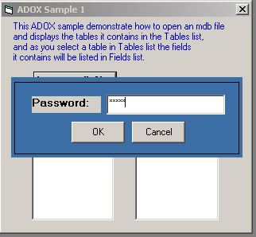



## ADOX tutorial 1

### Description

The code demonstrate the use of ADOX (Microsoft ActiveX Data Objects Extensions for Data Definition Language and Security).

This will be a series of sample codes that will demonstrate the use of ADOX.

For this sample the code will access an mdb file and display its tables and related fields in the listbox. Also supports password protected mdb file.
 
### More Info
 
To use ADOX with your development, you should establish a reference to the ADOX type library. The description of the ADOX library is "Microsoft ADO Ext. for DDL and Security." The ADOX library file name is Msadox.dll, and the program ID (ProgID) is "ADOX".

Please Vote and comment for this. THANKS!

             |
---                |---
**Submitted On**   |2003-04-19 22:46:02
**By**             |[Mitchelle Lirazan](https://github.com/Planet-Source-Code/PSCIndex/blob/master/ByAuthor/mitchelle-lirazan.md)
**Level**          |Advanced
**User Rating**    |4.8 (29 globes from 6 users)
**Compatibility**  |VB 5\.0, VB 6\.0
**Category**       |[Databases/ Data Access/ DAO/ ADO](https://github.com/Planet-Source-Code/PSCIndex/blob/master/ByCategory/databases-data-access-dao-ado__1-6.md)
**World**          |[Visual Basic](https://github.com/Planet-Source-Code/PSCIndex/blob/master/ByWorld/visual-basic.md)
**Archive File**   |[ADOX\_tutor1577234212003\.zip](https://github.com/Planet-Source-Code/mitchelle-lirazan-adox-tutorial-1__1-44917/archive/master.zip)

